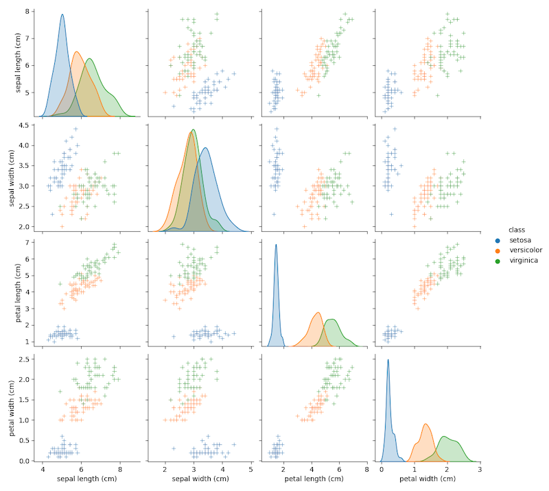

## Data preparation

Data preparation covers folowing steps.

- Reading data
- Inspecting dimension(rows, columns) and data type
- Inspecting value of the dataset
- Visualizing correlation among columns

The raw data could be in any form. For machine learning, however, features and class need to be in a matrix format.
Typically, during data preparation step, `numpy` and `pandas` packages are heavily used to transform raw data into matrix or table format.
While `numpy` is convenient for manuplicating array type of data, `pandas` is useful to manage data of table format using `DataFrame` type.

### 1. Reading raw data

In this example, we first read raw data using `sclearn`'s builtin dataset. Then, convert it to `DataFrame` format with features(`raw_dataset.data`) and class(`raw_dataset.target`)

```
from sklearn import datasets
import pandas as pd

# Read raw dataset
raw_dataset = datasets.load_iris()

# Construct dataset as DataFrame format
my_dataset = pd.DataFrame(raw_dataset.data, columns=raw_dataset.feature_names)
my_dataset['class'] = raw_dataset.target
```

### 2. Inspecting dimension(number of rows, number of columns) and data type

The first step in data prepatation is to figure out how many samples and how many features are there in the dataset.

```
my_dataset.info()
```

It shows that there are 150 samples(entries) and 5 columns. First four are numerical(floast64) and the last one is categorical(object)

```
<class 'pandas.core.frame.DataFrame'>
RangeIndex: 150 entries, 0 to 149
Data columns (total 5 columns):
 #   Column             Non-Null Count  Dtype  
---  ------             --------------  -----  
 0   sepal length (cm)  150 non-null    float64
 1   sepal width (cm)   150 non-null    float64
 2   petal length (cm)  150 non-null    float64
 3   petal width (cm)   150 non-null    float64
 4   class              150 non-null    object 
dtypes: float64(4), object(1)
memory usage: 6.0+ KB
```
### 3. Inspecting value of the dataset

After converting, we can print data of first 5 rows using `head` function. There are 5 columns in this dataset. First four of them are features, and the last one represents class.

```
print(my_dataset.head())
   sepal length (cm)  sepal width (cm)  petal length (cm)  petal width (cm)  class
0                5.1               3.5                1.4               0.2      0
1                4.9               3.0                1.4               0.2      0
2                4.7               3.2                1.3               0.2      0
3                4.6               3.1                1.5               0.2      0
4                5.0               3.6                1.4               0.2      0
```
All features here are numerical data, but, the class is a categorical data. Thus, we convert class from numeric to name of species to understand it easily.

```
my_dataset['class'].replace([0,1,2],raw_dataset.target_names, inplace=True)
```

Now, the table makes more sence to us (aka human).

```
print(my_dataset.head())
   sepal length (cm)  sepal width (cm)  petal length (cm)  petal width (cm)   class
0                5.1               3.5                1.4               0.2  setosa
1                4.9               3.0                1.4               0.2  setosa
2                4.7               3.2                1.3               0.2  setosa
3                4.6               3.1                1.5               0.2  setosa
4                5.0               3.6                1.4               0.2  setosa
```

For classification problem in machine learning, the level of balance in class is crutial to the performance of prediction. Thus, we must always inspect it as early as possible.

```
print(my_dataset['class'].value_counts())
```

In this dataset, there are three classes and each of them are exactly 50 samples. It indicates this dataseet is perfectly balanced. If not, we need to consider extra steps to minigate the negative effect caused by imbalanced dataset.

```
Count by class

setosa        50
versicolor    50
virginica     50
Name: class, dtype: int64
```

### 4. Visualizing correlation among columns

For visualizing correlation among features and class, we use `pairplot` function from `seabone` package.

```
import seaborn as sns
sns.pairplot(my_dataset,hue='class',markers='+')
```



It is impractical to visualize correlation this way if there is a large number of features in the dataset.