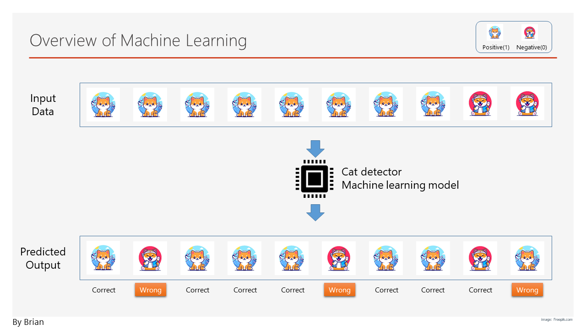

# Machine Learning Tutorial for Social Science Researchers

Originally, computer program executes rules provided by humans. But, in some applications where there are too much data or too many factors, it is not easy for a human to figure out the rules and give an order to a computer. In this case, we provide data to a computer, then let it figure out the rules by itself. This is the core concept of machine learning.

Social science researchers are familiar with various types of statistical analysis methods. Fortunately, these methods are very similar to popular machine learning methods.

__Statistical Analysis vs Machine Learning__

By comparing statistical analysis and machine learning, we can have a clear view of these two fields.  

|         | Statistical Analysis | Machine Learning |
|--------:| :----------------: | :--------------: |
| User    | Social Scientist | Computer Scientist |
| Purpose | Hypothesis testing | Predicting       |
| Results | Coefficient, p-value | Trained model |
| Tools   | R, Python | Python, R |

__Purpose of Machine Learning__

Unlike statistical analysis, the purpose of machine learning is to predict a value that is unknown at the time of prediction. The first type of problem is classification. Let's assume that we have a task that classifes cats and dogs, and we have a machine learning model called 'cat detector'. Based on the picture, it predicts whether the image is a cat or a dog just like in the figure below.

The purpose of this model is to classify binary values in the output. Thus, it is called a 'binary classification'. If there are more than two types of outputs, then it is called 'multiclass classification'. The second type of problem is 'regression'. In the case of house price estimation, it is to predict a continuous number, which is called 'regression'. The third type of problem is 'clustering'. Let's assume that there are lots of data and we would like to cluster them into multiple groups with similar characteristics. From machine learning's perspective, classification and regression belong to [supervised learning](Supervised.md), whereas clustering belongs to [unsupervised learning](Unsupervised.md).

| Binary Prediction | Multiclass Prediction | Clustering |
| :---------------: | :-------------------: | :--------: |
| Logistic regression | Linear Regression | K-means |
| Support Vector Machine | KNN | Topic Modeling |

This tutorial consists of three parts: 1) Data Preparation, 2) Supervised Machine Learning, 3) Unsupervised Machine Learning, and 4) Evaluation of Machine Learning Model. `scikit-learn` is used for example source codes in this tutorial for simplicity and clarity. 

1. [Data Preparation](Data_preparation.md)
2. [Supervised Machine Learning](Supervised.md)
3. [Unsupervised Machine Learning](Unsupervised.md)
4. [Evaluation of Machine Learning Model](Evaluation.md)